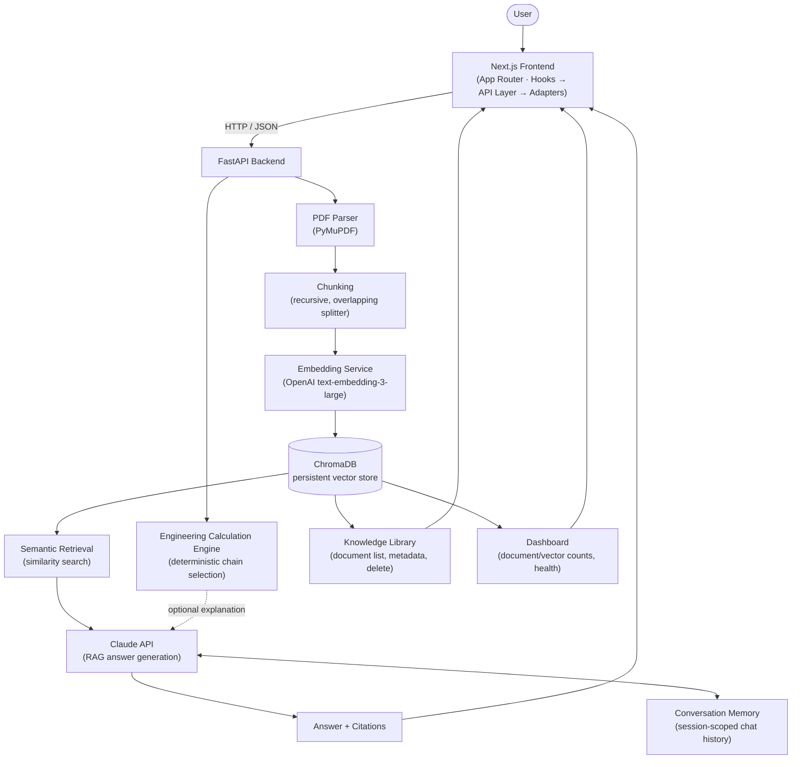
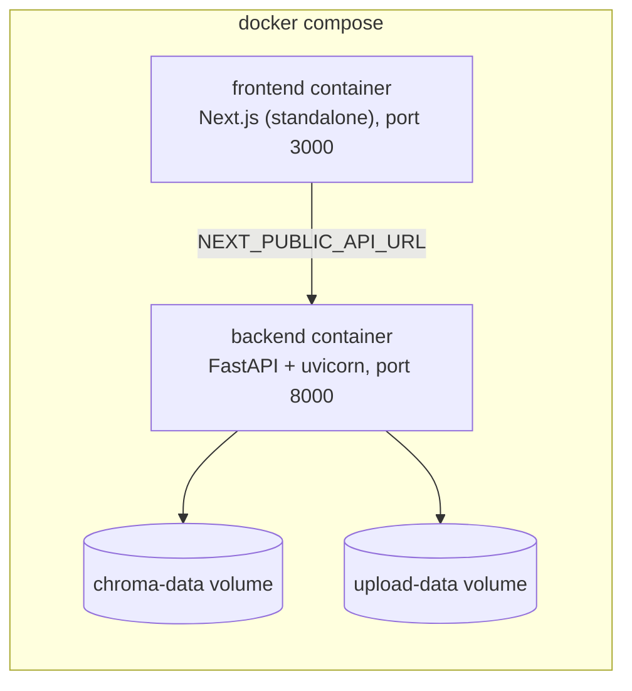

# Architecture

The Chain Reaction is a Retrieval-Augmented Generation (RAG) application:
a Next.js frontend talks to a FastAPI backend, which parses and indexes
PDF documents into a local vector store, then answers questions by
retrieving relevant chunks and passing them to Claude.

## Request Flow

## Component Notes

- **Frontend → API Layer → Adapters**: components never call `fetch`
  directly. Each feature has a hook (`src/hooks/use-*.ts`) that calls a
  typed API-layer function (`src/lib/api/*.ts`), whose response is passed
  through an adapter (`src/lib/api/adapters.ts`) that converts the
  backend's snake_case wire shape into the frontend's camelCase domain
  types.
- **PDF Parser → Chunking → Embedding → ChromaDB**: the document
  ingestion pipeline. Each stage is a separate, independently testable
  service (`backend/app/services/{parser,chunker,embeddings,vectorstore}`).
  Uploading a document runs all four in sequence.
- **Semantic Retrieval → Claude API**: answering a question embeds the
  question, retrieves the most similar stored chunks from ChromaDB, and
  passes them to Claude as grounding context. Claude answers only from
  what it was given — it does not use outside knowledge, and it never
  performs a calculation itself.
- **Conversation Memory**: an in-memory, session-scoped store of prior
  turns in the current conversation, so a follow-up question ("what about
  the 80 series instead?") resolves correctly. Not persisted across
  server restarts — there is no user-account or database layer yet.
- **Engineering Calculation Engine**: a deterministic Python
  implementation of roller-chain selection (chain type/standard, service
  factor, expected life). Claude is only ever asked to explain an
  already-computed result in plain English — never to perform the
  calculation.
- **Knowledge Library / Dashboard**: both are read views over the same
  ChromaDB-backed document store — the Knowledge Library lists and
  manages individual documents; the Dashboard aggregates them into
  knowledge-base-wide health metrics (document/vector counts, status
  breakdown, recent activity, system health).

## Deployment Shape

Two containers, two named volumes for persistence, no external
dependencies beyond the OpenAI and Anthropic APIs. See the root
[`README.md`](../README.md#docker) for the one-command startup.
